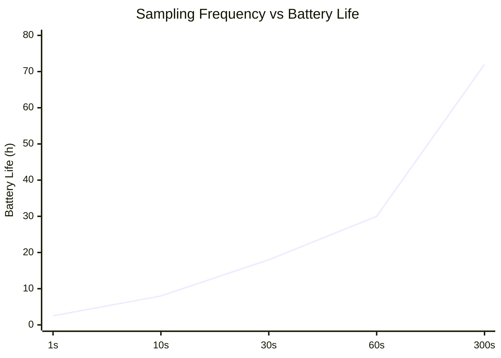
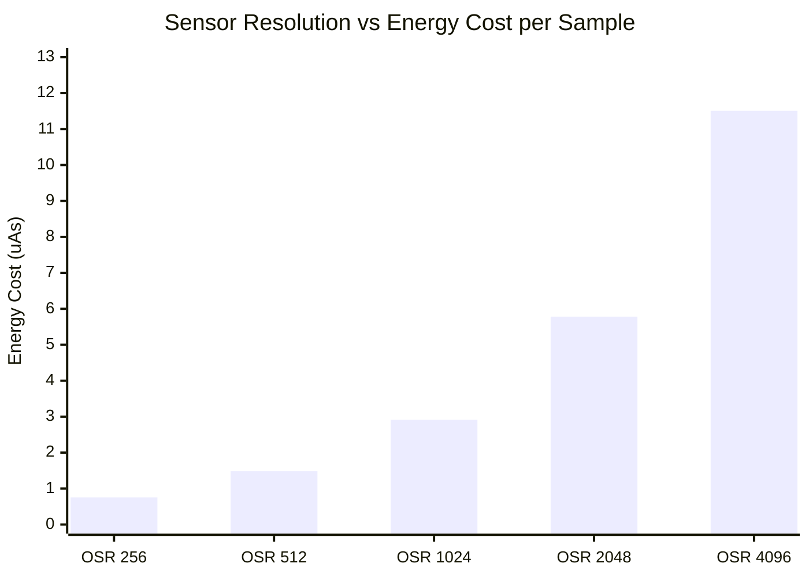

# Task1

## 📦 Deliverables
### 📄 Schematic Document

Below is the completed schematic design integrating the nRF52840 MCU, TPS62840 Buck Converter, LTC4311 I2C Bus Accelerator, and the BME680 / MS5607 sensor cluster.

> 📂 **[View Full Schematic (PDF)](./TASK1_Sch.pdf)**

---

### 📝 Design Decisions & Assumptions (147 words)

The proposed system consists of three primary functional blocks Power Management, Sensor Detection, and the Microprocessor. 
The system is centered around the nRF52840 chipset, configured in Normal Voltage Mode to supply a uniform 3.3V operating voltage across all onboard sensors. It also leverages the chip's internal USB-to-Serial capability, using the physical PHY circuit to automatically detect PC connections.To maximize efficiency, the power distribution utilizes a high-efficiency DC-DC buck converter with an ultra-low quiescent current ($I_q$) of 30nA. This replaces conventional LDO regulators, eliminating excessive thermal dissipation caused by voltage differentials and output current.The sensor detection block integrates two sensors that share identical default $I^2C$ address options (0x76 and 0x77). To prevent address collision on the same bus, the hardware was configured to allocate unique addresses by tying the SDO pin of the MS5607 to Low (GND) and the CSB pin of the BME680 to High (VCC).To support 400kHz high-speed $I^2C$ communication over a 2-meter cable, an $I^2C$ bus accelerator (rise-time accelerator) was implemented. This actively counters signal distortion caused by increased cable capacitance and guarantees sharp rise times, ensuring robust signal integrity. 

# Task2

## Power Budget and Long-term Viability Analysis
* **Target Operational Life:** 1 Year (365 Days)
* **Power Source Specification:** 3.6V 1200mAh Lithium Primary Battery
* **Theoretical Daily Energy Budget:** 3.29 mAh / day (Equivalent to a continuous 137 µA average current)
* **Practical Daily Energy Budget (20% Design Margin):** 2.63 mAh / day (Equivalent to a continuous 110 µA average current)

* ##

##  Sampling Frequency vs Battery Life 

## **Sensor Resolution vs Energy Cost per Sample**

Lowering the resolution minimizes energy consumption to a near-negligible level, but it inevitably degrades the sensor's detection performance. On the other hand, maximizing the resolution pushes the energy cost up to approximately 15 times that of the OSR 256 baseline. Therefore, looking at the data, OSR 1024 can be considered the most viable option as it provides the ideal balance between energy cost and precision.

## 📦 Deliverables

## Summary of your proposed solution

<svg width="600" height="320" viewBox="0 0 600 320" xmlns="http://www.w3.org/2000/svg">
  <rect width="600" height="320" fill="#0d1117" rx="8"/>

  <line x1="80" y1="20" x2="80" y2="240" stroke="#30363d" stroke-width="1"/>
  <line x1="80" y1="240" x2="560" y2="240" stroke="#30363d" stroke-width="1"/>
  <line x1="80" y1="180" x2="560" y2="180" stroke="#21262d" stroke-width="1" stroke-dasharray="3,3"/>
  <line x1="80" y1="120" x2="560" y2="120" stroke="#21262d" stroke-width="1" stroke-dasharray="3,3"/>
  <line x1="80" y1="60" x2="560" y2="60" stroke="#21262d" stroke-width="1" stroke-dasharray="3,3"/>

  <text x="70" y="244" fill="#58a6ff" font-size="10" text-anchor="end" font-family="monospace">0</text>
  <text x="70" y="184" fill="#58a6ff" font-size="10" text-anchor="end" font-family="monospace">68</text>
  <text x="70" y="124" fill="#58a6ff" font-size="10" text-anchor="end" font-family="monospace">136</text>
  <text x="70" y="64"  fill="#58a6ff" font-size="10" text-anchor="end" font-family="monospace">204</text>
  <text x="18" y="140" fill="#58a6ff" font-size="10" text-anchor="middle" font-family="monospace" transform="rotate(-90,18,140)">Current (uA)</text>

  <text x="160" y="258" fill="#8b949e" font-size="10" text-anchor="middle" font-family="monospace">-20 dBm</text>
  <text x="280" y="258" fill="#8b949e" font-size="10" text-anchor="middle" font-family="monospace">-4 dBm</text>
  <text x="400" y="258" fill="#8b949e" font-size="10" text-anchor="middle" font-family="monospace">0 dBm</text>
  <text x="520" y="258" fill="#8b949e" font-size="10" text-anchor="middle" font-family="monospace">8 dBm</text>
  <text x="340" y="285" fill="#8b949e" font-size="11" text-anchor="middle" font-family="monospace">TX Power (dBm)</text>

  <polyline points="160,192 280,149 400,152 520,31" fill="none" stroke="#58a6ff" stroke-width="2.5" stroke-linejoin="round" stroke-linecap="round"/>
  <polygon points="160,192 280,149 400,152 520,31 520,240 160,240" fill="#58a6ff" fill-opacity="0.07"/>

  <circle cx="160" cy="192" r="4" fill="#0d1117" stroke="#58a6ff" stroke-width="2"/>
  <circle cx="280" cy="149" r="4" fill="#0d1117" stroke="#58a6ff" stroke-width="2"/>
  <circle cx="400" cy="152" r="4" fill="#0d1117" stroke="#58a6ff" stroke-width="2"/>
  <circle cx="520" cy="31"  r="4" fill="#0d1117" stroke="#58a6ff" stroke-width="2"/>

  <text x="160" y="184" fill="#58a6ff" font-size="9" text-anchor="middle" font-family="monospace">54.3uA</text>
  <text x="280" y="141" fill="#58a6ff" font-size="9" text-anchor="middle" font-family="monospace">103uA</text>
  <text x="400" y="144" fill="#58a6ff" font-size="9" text-anchor="middle" font-family="monospace">100uA</text>
  <text x="520" y="23"  fill="#58a6ff" font-size="9" text-anchor="middle" font-family="monospace">238uA</text>

  <text x="320" y="14" fill="#f0f6fc" font-size="12" text-anchor="middle" font-family="monospace" font-weight="bold">TX Power vs Current Consumption</text>
</svg>

## Summary of your proposed solution

## 📊 Integrated Sensor Analysis Master Table

