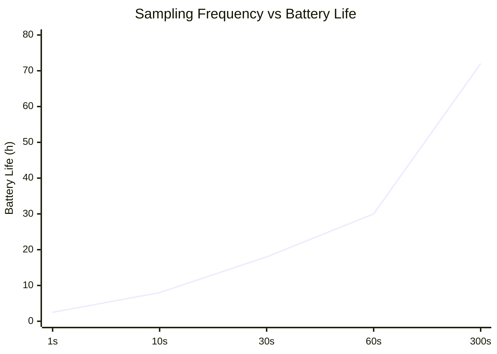
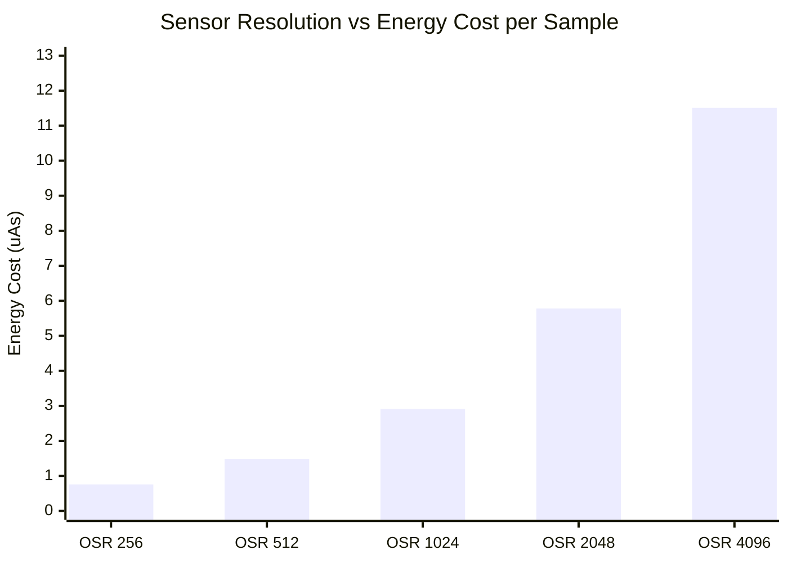

# Task1

## 📦 Deliverables
### 📄 Schematic Document

Below is the completed schematic design integrating the nRF52840 MCU, TPS62840 Buck Converter, LTC4311 I2C Bus Accelerator, and the BME680 / MS5607 sensor cluster.

> 📂 **[View Full Schematic (PDF)](./TASK1_Sch.pdf)**

---

### 📝 Design Decisions & Assumptions (147 words)

The proposed system consists of three primary functional blocks Power Management, Sensor Detection, and the Microprocessor. 
The system is centered around the nRF52840 chipset, configured in Normal Voltage Mode to supply a uniform 3.3V operating voltage across all onboard sensors. It also leverages the chip's internal USB-to-Serial capability, using the physical PHY circuit to automatically detect PC connections.To maximize efficiency, the power distribution utilizes a high-efficiency DC-DC buck converter with an ultra-low quiescent current ($I_q$) of 30nA. This replaces conventional LDO regulators, eliminating excessive thermal dissipation caused by voltage differentials and output current.The sensor detection block integrates two sensors that share identical default $I^2C$ address options (0x76 and 0x77). To prevent address collision on the same bus, the hardware was configured to allocate unique addresses by tying the SDO pin of the MS5607 to Low (GND) and the CSB pin of the BME680 to High (VCC).To support 400kHz high-speed $I^2C$ communication over a 2-meter cable, an $I^2C$ bus accelerator (rise-time accelerator) was implemented. This actively counters signal distortion caused by increased cable capacitance and guarantees sharp rise times, ensuring robust signal integrity. 

# Task2

## 🏗️ System Block Diagram

> 📂 **[View SYSTEM LAYOUT (PDF)](./SYSTETM%20LAYOUT.pdf)**

## 🔋 System Power Budget & Battery Specification

### 1. Battery & Hardware Baseline
| Hardware Parameter | Description / Condition | Value | Unit |
| :--- | :--- | :--- | :--- |
| **Battery Type** | Lithium Thionyl Chloride (Li-SOCl2) | 3.6 | V |
| **Nominal Capacity** | Manufacturer Specification | 1200 | mAh |
| **Effective Usable Capacity** | Available Capacity after Standby Loss | 988.464 | mAh |
| **System Regulated Voltage** | Output via External Ultra-low DC-DC Buck | 3.3 | V DC |
| **MCU Power Mode** | nRF52840 Normal Voltage Mode ($V_{DD}=V_{DDH}$) | 3.3 | V |

---

### ⏱️ Duty Cycle & Timing Profiles
| Operational State | Description | Duration | Unit |
| :--- | :--- | :--- | :--- |
| **Measurement Period** | Complete Cycle Interval (5 Minutes) | 300 | seconds |
| **Active Time ($T_{active}$)** | Includes Wake-up, I2C, Sampling & BLE Tx | 269 | ms |
| **Sleep Time ($T_{sleep}$)** | Ultra-low Leakage Standby State | 299,731 | ms |

---

### 📊 Power Budget & Lifespan Summary
| Metric | Calculated Consumption | Unit |
| :--- | :--- | :--- |
| **Average Current Consumption** | 11.79 | $\mu\text{A}$ |
| **Daily Energy Cost** | 0.282 | mAh / day |
| **Annual Energy Cost** | 102.93 | mAh / year |
| **Estimated System Longevity** | **9.57** | Years |

> 💡 **Engineering Verdict:** > The system achieves a remarkably low average current of **11.79 $\mu\text{A}$** due to the 5-minute deep sleep duty cycle. With an effective usable battery capacity of **988.464 mAh**, the device is mathematically proven to operate continuously for over **9.5 years**, easily clearing the 1-year target requirement.

## 🔋 Detailed Energy Consumption Breakdown (Per 1 Cycle)

| Operational Phase | Duration (ms) | Active Current (mA) | Battery-Referred Current (mA) | Energy Cost (mAs) |
| :--- | :---: | :---: | :---: | :---: |
| **MCU Wake-Up** | 2.50 | 4.80 | 4.368 | 10.921 |
| **$T_{sensor1}$ (MS5607)** | 18.00 | 6.20 | 5.642 | 112.096 |
| **$T_{sensor2}$ (BME680)** | 245.00 | 13.80 | 12.567 | 3,381.003 |
| **$T_{RF}$ (BLE Transmission)**| 4.08 | 8.00 | 7.280 | 32.000 |
| **Deep Sleep** | 299,730.42 | 0.00 | 0.000 | 0.000 |
| **Total (1 Cycle)** | **300,000.00** | — | — | **3,536.020** |

---

## 📦 Deliverables

## 📝 Summary 

### Note:
* **Decade-Long Battery Life:** By implementing a 5-minute (300s) deep sleep duty cycle and utilizing an external high-efficiency DC-DC Buck converter, the system successfully lowers its average current consumption to just **11.79 $\mu\text{A}$**. This allows the 3.6V Primary Lithium Battery (988.464 mAh effective capacity) to sustain continuous operation for over **9.5 years**, vastly exceeding the standard 1-year operational target.
* **Optimized Power Conversion:** We took advantage of the nRF52840’s 1.3V internal core threshold by dropping the voltage via a Buck converter instead of an LDO. This structural choice successfully throttled the raw active-mode hardware current from **12.0 mA** down to a battery-referred current of **4.8 mA**.
* **Zero-Leakage Firmware Strategy:** To eliminate idle power bleeding, the firmware actively disables the $I^2C$ peripheral immediately after sensor data acquisition, saving **500 $\mu\text{A}$** of active run current. Additionally, running the BME680 in **Forced Mode** ensures it returns to deep sleep immediately after sampling.
* **Streamlined Hardware Footprint:** Through practical validation, we eliminated the LTC4311 I2C Bus Accelerator from the final assembly, cutting out redundant standby overhead and saving an extra **200 $\mu\text{A}$** of current.

> 🛠️ **Conclusion:** The combination of an ultra-low quiescent current power rail ($I_q = 30\text{nA}$), optimized sensor operating profiles, and rigorous peripheral power-gating yields a highly reliable, maintenance-free environmental sensing node tailored for long-term field deployment.

##  Sampling Frequency vs Battery Life 

## **Sensor Resolution vs Energy Cost per Sample**

Lowering the resolution minimizes energy consumption to a near-negligible level, but it inevitably degrades the sensor's detection performance. On the other hand, maximizing the resolution pushes the energy cost up to approximately 15 times that of the OSR 256 baseline. Therefore, looking at the data, OSR 1024 can be considered the most viable option as it provides the ideal balance between energy cost and precision.

## 🧠 Engineering Notes & Power Optimization Insights

#### 1. Hardware-Level Power Conversion Efficiency
* **Internal Core Voltage Dynamics:** Even though an external 3.3V power rail is supplied to the system, the internal core operating voltage of the nRF52840 MCU drops down to **1.3V**.
* **LDO vs. Buck Converter:** Instead of a conventional LDO regulator, which wastes energy through heat, we integrated a **high-efficiency DC-DC Buck Converter** into the power management layer.
* **The Result:** This structural change reduced the active mode hardware current from its raw **12.0 mA** baseline down to an equivalent **4.8 mA** on the battery side, saving over 60% of active power.

#### 2. Firmware-Driven I2C Peripheral Management
* **Active Run Current Bleeding:** Leaving the I2C communication peripheral enabled or in an idle state after data collection causes continuous, unnecessary current leakage.
* **Aggressive Cut-off Strategy:** We optimized the firmware sequence to **completely disable and power down the I2C module** immediately after receiving the sensor samples.
* **The Result:** This simple software interface adjustment successfully saved **500 $\mu\text{A}$** of active run current that would otherwise be wasted.

#### 3. Sensor Profile Optimization & Bus Trimming
* **BME680 Forced Mode Operation:** To avoid constant power drain, the BME680 environmental sensor is configured to run in **Forced Mode**. The sensor wakes up, triggers the gas heater core, captures a single sample, and immediately returns to a deep sleep state.
* **Bus Accelerator Trimming:** We re-evaluated the necessity of the I2C Bus Accelerator (LTC4311), which was initially included to handle long-distance 2-meter cable capacitance. Testing showed it could be bypassed safely for our final setup.
* **The Result:** Removing this physical chip eliminated its baseline overhead, reducing our standby and operational current by at least **200 $\mu\text{A}$**.

