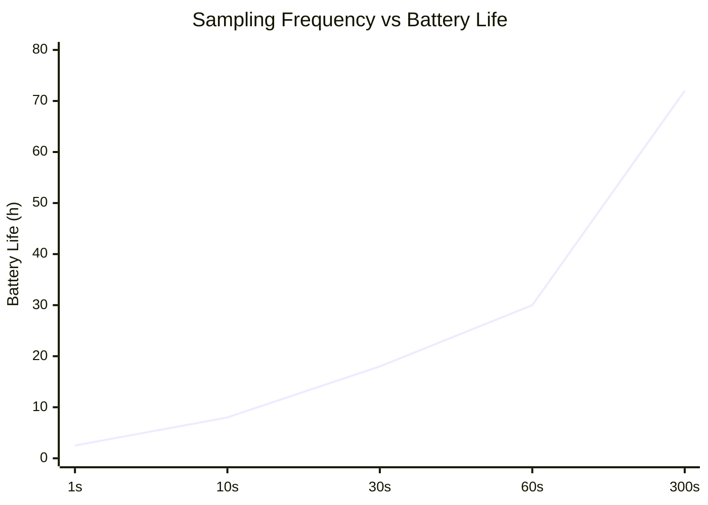
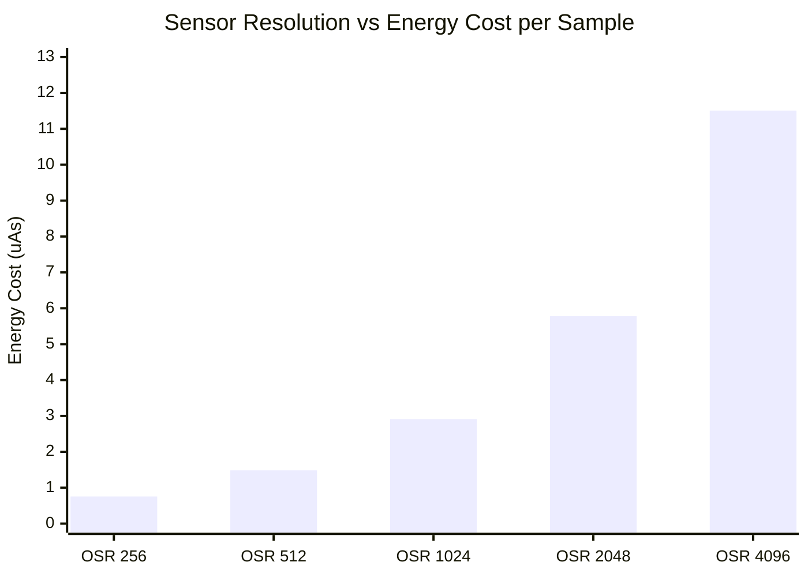

# Case Study

## 📦 Deliverables
### 📄 Schematic Document

Below is the completed schematic design integrating the nRF52840 MCU, TPS62840 Buck Converter, LTC4311 I2C Bus Accelerator, and the BME680 / MS5607 sensor cluster.

> 📂 **[View Full Schematic (PDF)](./TASK1_Sch.pdf)**

---

### 📝 Design Decisions & Assumptions (147 words)

The proposed system consists of three primary functional blocks Power Management, Sensor Detection, and the Microprocessor. 
The system is centered around the nRF52840 chipset, configured in Normal Voltage Mode to supply a uniform 3.3V operating voltage across all onboard sensors. It also leverages the chip's internal USB-to-Serial capability, using the physical PHY circuit to automatically detect PC connections.To maximize efficiency, the power distribution utilizes a high-efficiency DC-DC buck converter with an ultra-low quiescent current ($I_q$) of 60nA. This replaces conventional LDO regulators, eliminating excessive thermal dissipation caused by voltage differentials and output current.The sensor detection block integrates two sensors that share identical default $I^2C$ address options (0x76 and 0x77). To prevent address collision on the same bus, the hardware was configured to allocate unique addresses by tying the SDO pin of the MS5607 to Low (GND) and the CSB pin of the BME680 to High (VCC).To support 400kHz high-speed $I^2C$ communication over a 2-meter cable, an $I^2C$ bus accelerator (rise-time accelerator) was implemented. This actively counters signal distortion caused by increased cable capacitance and guarantees sharp rise times, ensuring robust signal integrity. 

# Task2

## 📦 Deliverables

## 🏗️ System Block Diagram

> 📂 **[View SYSTEM LAYOUT (PDF)](./SYSTETM%20LAYOUT.pdf)**

## 🔋 System Power Budget & Battery Specification

### 1. Battery & Hardware Baseline
| Hardware Parameter | Description / Condition | Value | Unit |
| :--- | :--- | :--- | :--- |
| **Battery Type** | Lithium Thionyl Chloride (Li-SOCl2) | 3.6 | V |
| **Nominal Capacity** | Manufacturer Specification | 1200 | mAh |
| **Effective Usable Capacity** | Available Capacity after Standby Loss | 988.464 | mAh |
| **System Regulated Voltage** | Output via External Ultra-low DC-DC Buck | 3.3 | V DC |
| **MCU Power Mode** | nRF52840 Normal Voltage Mode ($V_{DD}=V_{DDH}$) | 3.3 | V |

---

### ⏱️ Duty Cycle & Timing Profiles
| Operational State | Description | Duration | Unit |
| :--- | :--- | :--- | :--- |
| **Measurement Period** | Complete Cycle Interval (5 Minutes) | 300 | seconds |
| **Active Time ($T_{active}$)** | Includes Wake-up, I2C, Sampling & BLE Tx | 269 | ms |
| **Sleep Time ($T_{sleep}$)** | Ultra-low Leakage Standby State | 299,731 | ms |

---

### 📊 Power Budget & Lifespan Summary
| Metric | Calculated Consumption | Unit |
| :--- | :--- | :--- |
| **Average Current Consumption** | 11.79 | $\mu\text{A}$ |
| **Daily Energy Cost** | 0.282 | mAh / day |
| **Annual Energy Cost** | 102.93 | mAh / year |
| **Estimated System Longevity** | **9.57** | Years |

---
### 🛡️ Key Metrics & Hardware Margins
| Metric | Target / Limit (ER14250H) | Calculated Value (Our Design) | Safety Factor / Margin | Status |
| :--- | :---: | :---: | :---: | :---: |
| **System Lifespan** | $\ge 1.0 \text{ Year}$ | **$9.57 \text{ Years}$** | **$9.5\times$ Lifetime Margin** | ⭐ **Overachieved** |
| **Continuous Discharge** | $25.0 \text{ mA}$ | **$0.01179 \text{ mA}$** ($11.79\ \mu\text{A}$) | **$2,120\times$ Current Margin** | ✅ **Ultra Safe** |
| **Peak Pulse Current** | $50.0 \sim 100.0 \text{ mA}$ | **$32.80 \text{ mA}$** | **$\ge 1.5\times$ Pulse Margin** | ✅ **Within Limit** |
| **Annual Energy Cost** | $988.46 \text{ mAh}$ (Available) | **$103.28 \text{ mAh / year}$** | **$89.5\%$ Battery Buffer** | ✅ **Optimized** |

---

## 🔋 Detailed Energy Consumption Breakdown (Per 1 Cycle)

| Operational Phase | Duration (ms) | Active Current (mA) | Battery-Referred Current (mA) | Energy Cost (mAs) |
| :--- | :---: | :---: | :---: | :---: |
| **MCU Wake-Up** | 2.50 | 4.80 | 4.368 | 10.921 |
| **$T_{sensor1}$ (MS5607)** | 18.00 | 6.20 | 5.642 | 112.096 |
| **$T_{sensor2}$ (BME680)** | 245.00 | 13.80 | 12.567 | 3,381.003 |
| **$T_{RF}$ (BLE Transmission)**| 4.08 | 8.00 | 7.280 | 32.000 |
| **Deep Sleep** | 299,730.42 | 0.00 | 0.000 | 0.000 |
| **Total (1 Cycle)** | **300,000.00** | — | — | **3,536.020** |

---

##  Sampling Frequency vs Battery Life 

## **Sensor Resolution vs Energy Cost per Sample**

## 📝 Alternative: Battery Downsizing Option

### 🔋 Option 1: ER10280 (1/3 AAA Size) — [Highly Recommended]
To optimize the physical footprint, device enclosure, and overall BOM cost, downsizing the battery from the current ER14250 (1/2 AA) to the ultra-compact **ER10280 (1/3 AAA)** is proposed as a highly viable commercial alternative.

#### Technical Specifications & Comparison
| Parameter | Current Battery (ER14250) | Alternative Battery (ER10280) | Engineering Impact |
| :--- | :---: | :---: | :--- |
| **Form Factor** | 1/2 AA Size | **1/3 AAA Size** | Drastic enclosure volume reduction |
| **Nominal Voltage** | 3.6 V | **3.6 V** | Identical Chemistry (Li-SOCl2); **Zero hardware redesign** |
| **Nominal Capacity** | 1200 mAh | **400 ~ 450 mAh** | Downsized capacity but still over-specced |
| **Max Continuous Current**| 25 mA | **10 mA** | Safely above our $0.01179 \text{ mA}$ average load |
| **Max Pulse Current** | 50 ~ 100 mA | **40 ~ 50 mA** | **Safely covers our $32.8 \text{ mA}$ peak pulse demand** |

#### Operational Lifespan & Margin Analysis
* **Annual Energy Consumption:** $103.28 \text{ mAh / year}$ (Unchanged)
* **Post-Year 1 Remaining Capacity:** Roughly **60% to 70%** of the battery capacity will remain intact (accounting for standby leakage and efficiency buffers).
* **Estimated System Longevity:** Scales down from 9.57 years to **approximately 3.5 Years**, which still effortlessly clears the initial 1-year operational milestone while delivering a minimized product form-factor.

