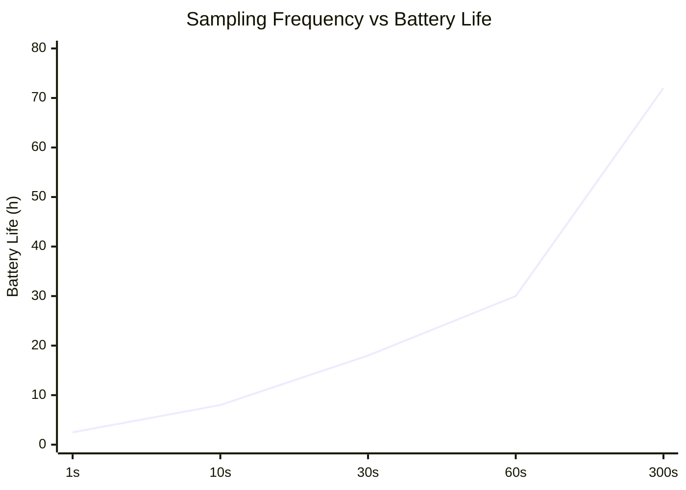
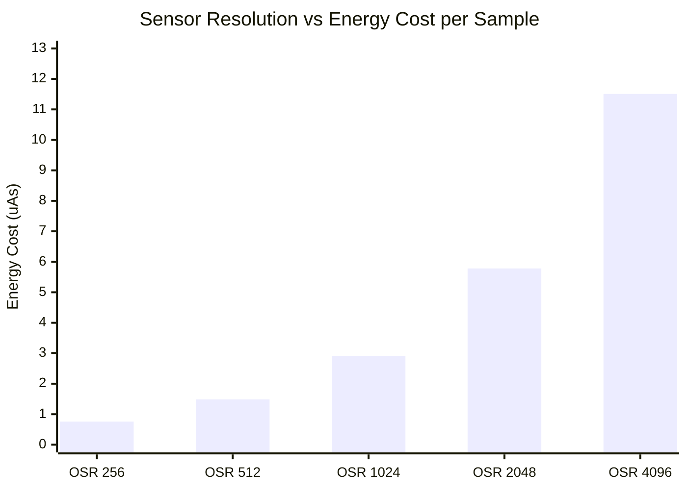

# Task1

## 📦 Deliverables
### 📄 Schematic Document

Below is the completed schematic design integrating the nRF52840 MCU, TPS62840 Buck Converter, LTC4311 I2C Bus Accelerator, and the BME680 / MS5607 sensor cluster.

> 📂 **[View Full Schematic (PDF)](./TASK1_Sch.pdf)**

---

### 📝 Design Decisions & Assumptions (147 words)

The proposed system consists of three primary functional blocks Power Management, Sensor Detection, and the Microprocessor. 
The system is centered around the nRF52840 chipset, configured in Normal Voltage Mode to supply a uniform 3.3V operating voltage across all onboard sensors. It also leverages the chip's internal USB-to-Serial capability, using the physical PHY circuit to automatically detect PC connections.To maximize efficiency, the power distribution utilizes a high-efficiency DC-DC buck converter with an ultra-low quiescent current ($I_q$) of 30nA. This replaces conventional LDO regulators, eliminating excessive thermal dissipation caused by voltage differentials and output current.The sensor detection block integrates two sensors that share identical default $I^2C$ address options (0x76 and 0x77). To prevent address collision on the same bus, the hardware was configured to allocate unique addresses by tying the SDO pin of the MS5607 to Low (GND) and the CSB pin of the BME680 to High (VCC).To support 400kHz high-speed $I^2C$ communication over a 2-meter cable, an $I^2C$ bus accelerator (rise-time accelerator) was implemented. This actively counters signal distortion caused by increased cable capacitance and guarantees sharp rise times, ensuring robust signal integrity. 

# Task2

## Power Budget and Long-term Viability Analysis
* **Target Operational Life:** 1 Year (365 Days)
* **Power Source Specification:** 3.6V 1200mAh Lithium Primary Battery
* **Theoretical Daily Energy Budget:** 3.29 mAh / day (Equivalent to a continuous 137 µA average current)
* **Practical Daily Energy Budget (20% Design Margin):** 2.63 mAh / day (Equivalent to a continuous 110 µA average current)

* ##

##  Sampling Frequency vs Battery Life 

## **Sensor Resolution vs Energy Cost per Sample**

Lowering the resolution minimizes energy consumption to a near-negligible level, but it inevitably degrades the sensor's detection performance. On the other hand, maximizing the resolution pushes the energy cost up to approximately 15 times that of the OSR 256 baseline. Therefore, looking at the data, OSR 1024 can be considered the most viable option as it provides the ideal balance between energy cost and precision.

## 📦 Deliverables

## Summary of your proposed solution

graph TD
    %% Style Definitions
    classDef power fill:#f9f,stroke:#333,stroke-width:2px;
    classDef mcu fill:#bbf,stroke:#333,stroke-width:2px;
    classDef sensor fill:#dfd,stroke:#333,stroke-width:2px;
    classDef rf fill:#fdd,stroke:#333,stroke-width:2px;

    %% Power Management Layer (Top)
    BAT["🔋 3.6V Primary Lithium Battery (85% Usable / 1020mAh Margin)"] -->|"Main Power Input"| BUCK["⚡ TPS62840 DC-DC Buck Converter (Iq = 60 nA / 88% Eff)"]
    BUCK -->|"Output Stage"| CAP["🔋 Low-ESR Decoupling Cap Network (Suppresses 23.84 mA Peak Load)"]
    CAP -->|""| RAIL["🔌 3.3V System Power Rail"]

    %% Connected Power Rails
    RAIL -.->|"3.3V"| MCU
    RAIL -.->|"3.3V"| MS5607
    RAIL -.->|"3.3V"| BME680

    %% Sensor Input Layer (Left)
    subgraph Sensor Input Layer
        MS5607["🌡️ MS5607 Barometric Sensor (OSR 1024 / 1s Sampling) Avg: 2.91 µA"]
        BME680["🍃 BME680 Environmental Sensor (Gas Heater / 300s Sampling) Avg: 50.00 µA"]
    end

    %% Control & Connectivity Layer (Center/Right)
    MCU["🧠 nRF52840 MCU (Normal Voltage Mode / 3.3V) 1s Cycle (5ms Active / 995ms Sleep) Avg: 51.00 µA"]
    ANT["📡 BLE Antenna Block (Tx Power: 0 dBm Optimized)"]

    %% Data Flow Connections
    MS5607 -->|"I2C / SPI Bus"| MCU
    BME680 -->|"I2C / SPI Bus"| MCU
    MCU -->|"RF TX Signal"| ANT

    %% Applying Styles
    class BAT,BUCK,CAP,RAIL power;
    class MCU mcu;
    class MS5607,BME680 sensor;
    class ANT rf;

## Summary of your proposed solution

## 📊 Integrated Sensor Analysis Master Table

* **Power Source:** 3.6V 1200mAh Lithium Primary Battery
* **MS5607 Configuration:** OSR 4096 (Highest Resolution: $I_{active} = 1.4\text{ mA}$, $T_{active} = 8.22\text{ ms}$)
* **BME680 Configuration:** Default Mode with Gas Sensor Active ($I_{active} = 13\text{ mA}$, $T_{active} = 350\text{ ms}$)
* **Base System Sleep Current:** $50\,\mu\text{A}$ (Includes MCU Stop Mode baseline)
