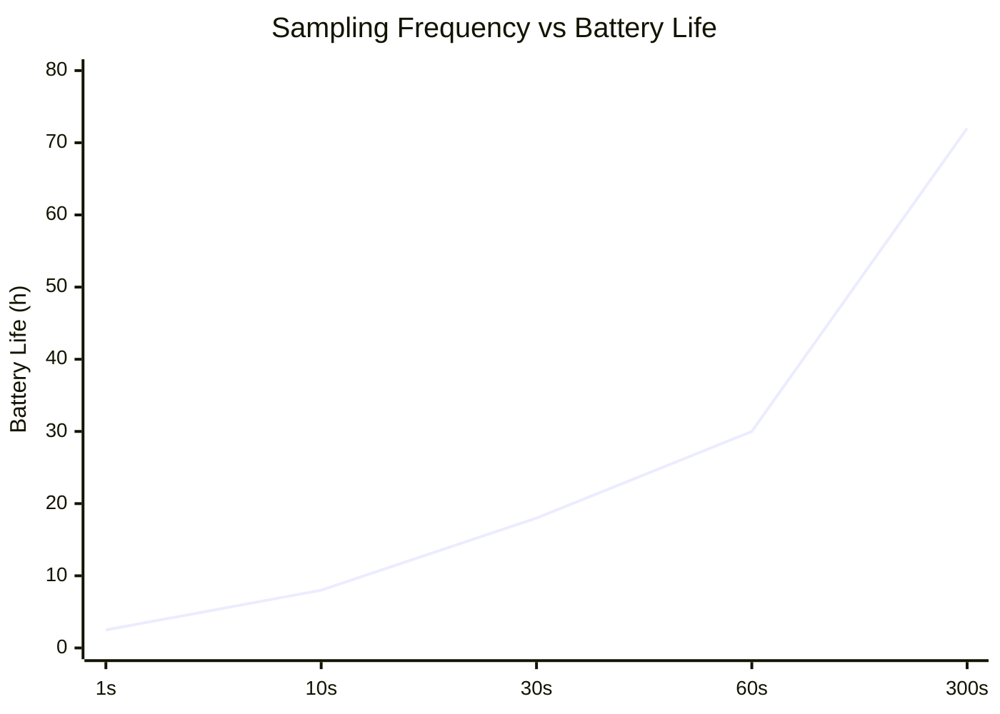
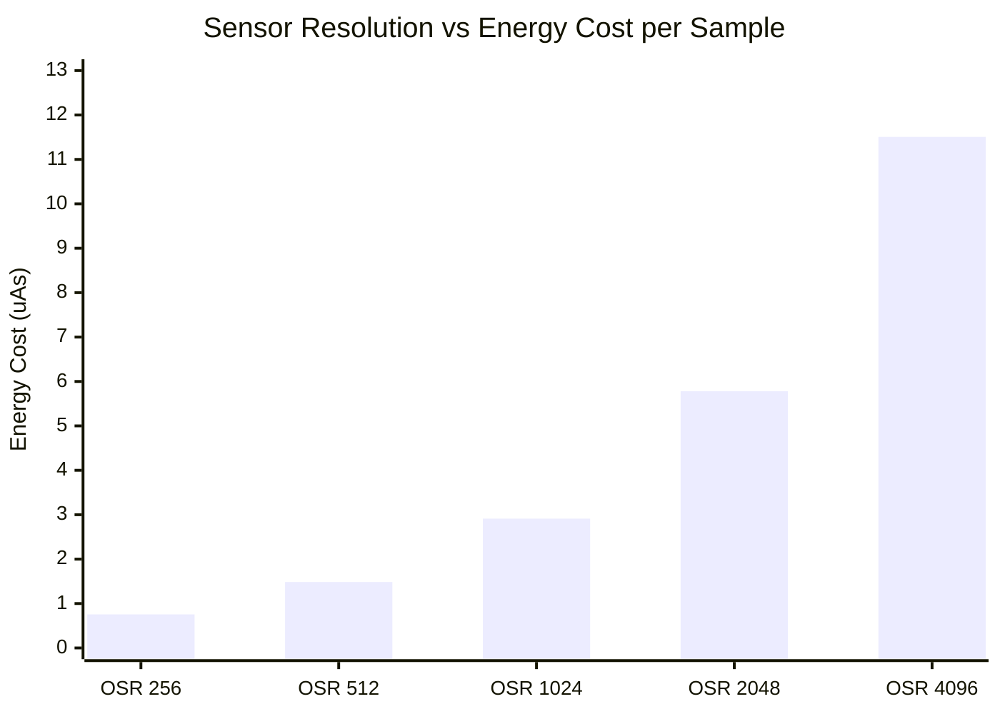

# Case Study

## 📦 Deliverables
### 📄 Schematic Document

Below is the completed schematic design integrating the nRF52840 MCU, TPS62840 Buck Converter, LTC4311 I2C Bus Accelerator, and the BME680 / MS5607 sensor cluster.

> 📂 **[View Full Schematic (PDF)](./TASK1_Sch.pdf)**

---

### 📝 Design Decisions & Assumptions (147 words)

The proposed system consists of three primary functional blocks Power Management, Sensor Detection, and the Microprocessor. 
The system is centered around the nRF52840 chipset, configured in Normal Voltage Mode to supply a uniform 3.3V operating voltage across all onboard sensors. It also leverages the chip's internal USB-to-Serial capability, using the physical PHY circuit to automatically detect PC connections.To maximize efficiency, the power distribution utilizes a high-efficiency DC-DC buck converter with an ultra-low quiescent current ($I_q$) of 60nA. This replaces conventional LDO regulators, eliminating excessive thermal dissipation caused by voltage differentials and output current.The sensor detection block integrates two sensors that share identical default $I^2C$ address options (0x76 and 0x77). To prevent address collision on the same bus, the hardware was configured to allocate unique addresses by tying the SDO pin of the MS5607 to Low (GND) and the CSB pin of the BME680 to High (VCC).To support 400kHz high-speed $I^2C$ communication over a 2-meter cable, an $I^2C$ bus accelerator (rise-time accelerator) was implemented. This actively counters signal distortion caused by increased cable capacitance and guarantees sharp rise times, ensuring robust signal integrity. 

# Task2

## 📦 Deliverables

## 🏗️ System Block Diagram

> 📂 **[View SYSTEM LAYOUT (PDF)](./SYSTETM%20LAYOUT.pdf)**

## 🔋 System Power Budget & Battery Specification

### 1. Battery & Hardware Baseline
| Hardware Parameter | Description / Condition | Value | Unit |
| :--- | :--- | :--- | :--- |
| **Battery Type** | Lithium Thionyl Chloride (Li-SOCl2) | 3.6 | V |
| **Nominal Capacity** | Manufacturer Specification | 1200 | mAh |
| **Effective Usable Capacity** | Available Capacity after Standby Loss | 988.464 | mAh |
| **System Regulated Voltage** | Output via External Ultra-low DC-DC Buck | 3.3 | V DC |
| **MCU Power Mode** | nRF52840 Normal Voltage Mode ($V_{DD}=V_{DDH}$) | 3.3 | V |

---

### ⏱️ Duty Cycle & Timing Profiles
| Operational State | Description | Duration | Unit |
| :--- | :--- | :--- | :--- |
| **Measurement Period** | Complete Cycle Interval (5 Minutes) | 300 | seconds |
| **Active Time ($T_{active}$)** | Includes Wake-up, I2C, Sampling & BLE Tx | 269 | ms |
| **Sleep Time ($T_{sleep}$)** | Ultra-low Leakage Standby State | 299,731 | ms |

---

### 📊 Power Budget & Lifespan Summary
| Metric | Calculated Consumption | Unit |
| :--- | :--- | :--- |
| **Average Current Consumption** | 11.79 | $\mu\text{A}$ |
| **Daily Energy Cost** | 0.282 | mAh / day |
| **Annual Energy Cost** | 102.93 | mAh / year |
| **Estimated System Longevity** | **9.57** | Years |

---
### 🛡️ Key Metrics & Hardware Margins
| Metric | Target / Limit (ER14250H) | Calculated Value (Our Design) | Safety Factor / Margin | Status |
| :--- | :---: | :---: | :---: | :---: |
| **System Lifespan** | $\ge 1.0 \text{ Year}$ | **$9.57 \text{ Years}$** | **$9.5\times$ Lifetime Margin** | ⭐ **Overachieved** |
| **Continuous Discharge** | $25.0 \text{ mA}$ | **$0.01179 \text{ mA}$** ($11.79\ \mu\text{A}$) | **$2,120\times$ Current Margin** | ✅ **Ultra Safe** |
| **Peak Pulse Current** | $50.0 \sim 100.0 \text{ mA}$ | **$32.80 \text{ mA}$** | **$\ge 1.5\times$ Pulse Margin** | ✅ **Within Limit** |
| **Annual Energy Cost** | $988.46 \text{ mAh}$ (Available) | **$103.28 \text{ mAh / year}$** | **$89.5\%$ Battery Buffer** | ✅ **Optimized** |

---

## 🔋 Detailed Energy Consumption Breakdown (Per 1 Cycle)

| Operational Phase | Duration (ms) | Active Current (mA) | Battery-Referred Current (mA) | Energy Cost (mAs) |
| :--- | :---: | :---: | :---: | :---: |
| **MCU Wake-Up** | 2.50 | 4.80 | 4.368 | 10.921 |
| **$T_{sensor1}$ (MS5607)** | 18.00 | 6.20 | 5.642 | 112.096 |
| **$T_{sensor2}$ (BME680)** | 245.00 | 13.80 | 12.567 | 3,381.003 |
| **$T_{RF}$ (BLE Transmission)**| 4.08 | 8.00 | 7.280 | 32.000 |
| **Deep Sleep** | 299,730.42 | 0.00 | 0.000 | 0.000 |
| **Total (1 Cycle)** | **300,000.00** | — | — | **3,536.020** |

---


##  Sampling Frequency vs Battery Life 



## **Sensor Resolution vs Energy Cost per Sample**


## 📝 Alternative: Battery Downsizing Option


### 🛡️ Key Metrics & Hardware Margins (LS14250 vs. ER10280)
| Metric | Target / Limit | Current Design **(Saft LS14250)** | Alternative Design **(ER10280)** | Status & Comparison |
| :--- | :---: | :---: | :---: | :--- |
| **System Lifespan** | $\ge 1.0 \text{ Year}$ | **$9.57 \text{ Years}$**<br>($9.5\times$ Margin) | **$\approx 3.5 \text{ Years}$**<br>($3.5\times$ Margin) | ⭐ **Both Overachieved**<br>· LS14250: Extreme longevity<br>· ER10280: Optimized footprint |
| **Continuous Discharge** | Saft: $25.0 \text{ mA}$<br>ER: $10.0 \text{ mA}$ | **$0.01179 \text{ mA}$**<br>($2,120\times$ Margin) | **$0.01179 \text{ mA}$**<br>($848\times$ Margin) | ✅ **Ultra Safe**<br>Both remain orders of magnitude below the physical continuous limits. |
| **Peak Pulse Current** | Saft: $100.0 \text{ mA}$<br>ER: $40 \sim 50 \text{ mA}$ | **$32.80 \text{ mA}$**<br>($3.0\times$ Margin) | **$32.80 \text{ mA}$**<br>($\ge 1.2\times$ Margin) | ✅ **Within Limit**<br>ER10280 tightly but safely accommodates the transient load. |
| **Annual Energy Budget** | Available Cap:<br>· Saft: $988.46 \text{ mAh}$<br>· ER: $\approx 360 \text{ mAh}$* | **$103.28 \text{ mAh / year}$**<br>($89.5\%$ Buffer) | **$103.28 \text{ mAh / year}$**<br>($\approx 71.3\%$ Buffer) | ✅ **Optimized**<br>Calculated annual consumption ($103.28\text{ mAh}$) remains unchanged. |

> `*` Note: ER10280 Available Capacity ($\approx 360\text{ mAh}$) is estimated assuming a 15% safety/chemical margin from its nominal $425\text{ mAh}$ profile.

# ⚖️ Engineering Trade-Off Analysis
> **Hardware & energy constraint optimization — three key trade-offs**

본 시스템 설계 과정에서 직면한 하드웨어 및 에너지 제약 조건을 해결하기 위해 다음 **3가지 핵심 트레이드오프**를 정량적 데이터 플롯을 통해 정의하고 최적화를 수행했습니다.

---

### 📊 Trade-off 1: Sampling Interval vs. Battery Lifespan
측정 주기가 길어질수록 배터리 수명은 기하급수적으로 증가합니다. 본 설계의 최적화된 프로필은 300초(5분) 주기로 세팅되어 데이터의 최신성을 유지함과 동시에 다년간의 필드 신뢰성을 보장합니다.

* **Minimum Viable Limit (1년 수명 타깃을 만족하기 위한 최소 물리적 한계점):** 78 s ($\approx 2.50\text{ Years}$)
* **Our Selected Configuration (최적화된 5분 주기 설계 안):** 300 s ($\approx 9.57\text{ Years}$)

```mermaid
xychart-beta
    title "Sampling Interval vs. Battery Lifespan (Years)"
    x-axis ["10s", "30s", "60s", "78s", "120s", "180s", "300s"]
    y-axis "Battery Life (Years)" 0 --> 11
    line [0.35, 1.05, 2.11, 2.50, 3.91, 6.10, 9.57]

### 📊 Trade-off 1: Sampling Interval vs. Battery Lifespan

xychart-beta
    title "Energy Consumption Breakdown per Phase (mAs)"
    x-axis ["MCU Wake", "MS5607", "BME680", "BLE Tx"]
    y-axis "Energy (mAs)" 0 --> 3500
    bar [10.92, 112.10, 3381.00, 32.00]

